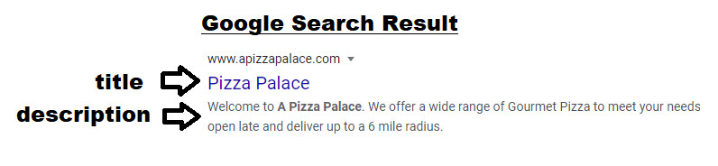

# CS Volunteer - Summer Curriculum
### Week 1-5: Python Beginner
#### Week 1: Introduction to CS (@jiinjeong)
* **What is Python?**: A programming language is a set of instructions for a computer to perform specific tasks. There are many programming languages including Java, C, C++, Ruby, etc. Python is an interpreted, high-level, general-purpose programming language created in 1991 by the Dutch programmer Guido van Rossum. The current stable release is version 3.8, so we typically say we are using Python3.
* **REPL**: [REPL](repl.it) is an online-based text editor. Advantage is that it supports many programming languages and that you don't need to download anything to run the program.
* **Print**: Prints a message to the screen.
```python
    print("Hello world")
```
* **Data types**: Tells the computer how the programmer intends to use the data. There are four primitive data types in Python: string (str), integer (int), floating-point numbers (float), and booleans (bool).
  * Strings are sequences of characters. They are in single-quotes ('') or double-quotes (""). For example, "Hello", "123", and "abc."
  * Integers are numeric values without decimals, such as 0, 2, 10.
  * Floats are more complex numeric values with decimals, such as 0.001, 0.5, 0.2.
  * Booleans are True/False.
  * We can check with `type()`.
```python
    print(type("Hamilton College"))
    print(type(10))
    print(type(0.11))
    print(type(True))
```
* **When to use what?**:
  * Name --> String
  * Address --> String
  * License Plate --> String (although it contains numeric values)
  * Number of pets --> Integer (you can't have 2.2 dogs)
  * Zipcode --> Integer
  * Bank balance --> Float
  * Height/Weight --> Float
  * Marital status --> Bool (True/False)
  * Shipment status --> Bool (True/False)
* **Comment**: To make single-line comments, you use a hashtag (#). Multiline comments are in three double-quotes (""" """). Computer will not execute comments. They are useful as they can explain to you/other programmers what your code does.
```python
   # This is a single-line comment.
   """
     This is a multi-line
     comment that can span over
     multiple lines.
   """
```
* **Variable**: Stores a value; can be changed (contrast with constant).
```python
    var_name = value    # The value can be of any data type (str/int/float/bool)
    # 1. Use a descriptive name
    something = "USA"   # X
    country = "USA"     # O
    # 2. Instead of spaces, use underscore (_)
    first name = "Jiin" # X
    first_name = "Jiin" # O
    # 3. Can't start with a number
    1score = 100        # X
    score1 = 100        # O
    # 4. Variable names are case-sensitive (Name and name are different). Usually, we should start with a lowercase.
    Is_student = False  # O
    is_student = False  # O
```
* **Input**: Allows user input, adding interactivity to your program.
* **String Concatenation**: Strings can be added with +.
```python
    name = input("What is your name? ")
    print("Hello " + name)
```
* **Function**: Block of code that is only run when called. Functions are useful for code organization and reusability. Analogy: You can think of a function as a "file" for your code. You create a file with content that serve a purpose. To access a file, you have to open the file (=call the file).
```python
# Defining a function
def func_name():
    print("Hello)"  # Anything inside the function, indent with four spaces.
# Calling a function
func_name()
```
Actual example:
```python
# Defining a function
def greet():
    print("Hello)"  # Anything inside the function, indent with four spaces.
# Calling a function
greet()
```
* **Main function**: Acts as the starting point of execution for the code.
```python
def main():
    greet()

if __name__ == "__main__":
    main()
```
* [Potential Projects](https://github.com/jiinjeong/CS4All/blob/master/PythonBeg/week1.py) (Lab/Assignment)

#### Week 2: Math (@Ian)
* **Math**
    * Addition (+)
    ```python3
    >>> 10 + 7
    17
    ```
    * Subtraction (-)
    ```python3
    >>> 5 + 47
    52
    >>> 4 - 12
    -8
    ```
    * Multiplication (*)
    ```python3
    >>> 4 * 12
    48
    >>> 2 * -9
    -18
    ```
    * Division (/)
    ```python3
    >>> 140 / 5
    28
    ```
    * Integer division (//): Division with truncation - rounding down
    ```python3
    >>> 25 // 5
    5
    >>> 26 // 5
    5
    >>> 9 // 2
    4
    ```
    * Modulus (%): Remainder after division.
    ```python3
    >>> 27 % 5  # 27 divided by 5 is 5 remainder 2
    2
    >>> 24 % 12 # 24 divided by 12 is 2 remainder 0
    0
    ```
    * Exponent (**): Operand for raising a number to a power 
    ```python3
    >>> 2 ** 4  # 2 raised to power 4
    16
    >>> 36 ** 0.5  # can even do a square root
    6.0
    ```
    * Order of operations: Math operations in Python conform to the normal order of operations.
    ```python3
    >>> 2 + 4 - 7 * 18 / 2
    -57.0
    >>> (32 - 7) + 48 / 4
    37.0
    ```
    * round(): Can pass optional arguments to make your rounding more specific
    ```python3
    >>> round(45.234141312)
    45
    >>> round(34562.9233232)
    34563
    >>> round(475.789, 2)
    475.79
    >>> round(47589.54789, -3)
    48000
    ```
* **Type Casting / Type Conversion**
  * Type casting/conversion is changing a value's type to the desired type (as long as it is compatible)
    ```python3
	>>> 45 / 5  # gives you a float type as the answer
	9.0
	>>> int(45/5) # type casting ensures you get an integer as your answer
	9
	>>> float(7)
	7.0
	>>> str(float(7))
	'7.0'
	>>> int("567")
	567
	>>> str(541)
	"541"
	>>> int("m")  # has to be compatible, can't convert such a string to int
	Traceback (most recent call last):
  	    File "<pyshell#14>", line 1, in <module>
    		int("m")
	ValueError: invalid literal for int() with base 10: 'm'
    ```
  * How is this useful? Many ways! An example would be if you receive numbers as strings and need to do some math with the numbers, type conversion will help.

* **String Interpolation**
  * String interpolation is having placeholders in a string into which you can substitute a variable value. Also known as string formatting
  * The two most common methods are %-formatting and str.format()
  * %-formatting example
  ```python3
  >>> name = "Ian"
  >>> print("Hello %s" %name)  # s is for string
  Hello Ian
  >>> age = 47
  >>> print("%s is %i years old" %(name, age))  # i is for integer
  ```
  * str.format() example
  ``` python3
  >>> average_time = 4  
  >>> avg_distance = 325
  >>> print("His average speed was {} kilometers per hour".format(avg_distance / average_time))
  His average speed was 81.25 kilometers per hour
  >>> print("His average speed with one decimal place was {:.1f} kilometers per hour".format(avg_distance / average_time))
  His average speed with one decimal place was 81.2 kilometers per hour
  >>> hour_hand = 4
  >>> minute_hand = 9
  >>> print("The time now is {:02d}:{:02d} pm".format(hour_hand, minute_hand))
  The time now is 04:09 pm
  ```
  * Other string interpolation methods that can be explored are f-strings and template strings
	
* [Potential Projects](https://github.com/jiinjeong/CS4All/blob/master/PythonBeg/week2.py) (Lab/Assignment)


#### Week 3: Conditions and If Statementt
I don't know how to format Github, have a start here.
https://docs.google.com/document/d/11L-Ah5z6BAZWCaVEs3t1Ejd2yfX-drkQ6_AMbMsDkao/edit
* [Potential Projects](https://github.com/jiinjeong/CS4All/blob/master/PythonBeg/week3.py) (Lab/Assignment)

#### Week 4: List, Indexing, and Random Library (@evaborton)
* **What is a list?**
    * A list of objects— can be strings, integers, Booleans, floats, anything. Elements of a list can even be lists themselves.
    * A list is surrounded by square brackets, and objects are separated by a comma
    * Can be changed/modified
```python3
newList = [7, ‘a’, False, 4.2]
pyList = list(‘python’)		# pyList = [‘p’, ‘y’, ‘t’, ‘h’, ‘o’, ‘n’]
```    
* Lists are their own type, just like str or int:
```python3
print(type(newList))	# Prints: <class ‘list’>
```
* **Indexing**
* Each element in a list is assigned an index, starting at 0 (not 1!). Each element can be accessed through its index:
```python3
newList = [7, ‘a’, False, 4.2, 13]
print(newList[0])	# Prints: 7
print(newList[1])	# Prints: a
print(newList[5])	# IndexError: list index out of range
```
* Each element can also be accessed through reverse indexing, where the last element in the list has the index -1, the second-to-last has index -2, and so on:
```python3
newList = [7, ‘a’, False, 4.2, 13]
print(newList[-1])	# Prints: 13
print(newList[-3])	# Prints: False
```
* List indexing can also be used to slice certain pieces of lists. In square brackets, the first number is the starting point of the slice (inclusive) and the second number is the ending point of the slice (exclusive). If there is a third number, it is the number to skip-count by (for example, 2 means every other, 3 means every third, and -1 means every element working backwards). See examples below:
```python3
numList = [3, 4, 5, 6, 7, 8, 9, 10, 11, 12, 13]
a = numList[3:8]	# a = [6, 7, 8, 9, 10]
b = numList[1:9:2]	# b = [4, 6, 8, 10]
```
* If no start point is specified, the slice starts from the beginning, and if no endpoint is specified, the slice goes to the end.
```python3
numList = [3, 4, 5, 6, 7, 8, 9, 10, 11, 12, 13]
c = numList[5:]	# c = [8, 9, 10, 11, 12, 13]
d = numList[::-1]	# d = [13, 12, 11, 10, 9, 8, 7, 6, 5, 4, 3]
```
* All of these indexing rules can be used with strings, as well. Each character in the string is treated like each element of a list.
```python3
string = ‘Hello, world!’
e = string[5]		# e = ‘,’
f = string[1:11:2]	# f = ‘el,wr’
```
* The list class comes with many different methods that are useful for changing or finding out characteristics of lists. There are too many to list here, but these are a few of the most useful. The rest can be found with a google search.
	* len(list name)—returns number of elements in list
	* list name.append(single element to add to end of list)
	* list name.extend(list to add to end of list)
	* list name.sort(key to sort by—if no key is specified, sorts numerically/alphabetically)
	* Other methods can filter, add/remove specific elements at specific indices, count number of times an element appears in a list, etc. Just google Python List Methods!

* **Libraries**
	* Libraries are packages of functions useful for some specific purpose. For example, the arcade library is useful for designing video games, the turtle library can be used to draw graphics, and the random library contains functions that can do things like selecting random numbers or random items from a list.
	* Python has hundreds of libraries!
	* Some libraries need to be installed to your device with an installer called pip before you can use them, but since we're using REPL, an online text editor, we don't need to worry about that.
	* Libraries can be easily accessed by typing the word import followed by the name of the library at the top of your program.
	* Once the library is imported, all functions in the library can be used by typing the library name, a dot, and the name of the function. See examples from the random library below:

* **Random Library**
```python3
import random
```
* Once the above line of code is typed, all functions in the random library can be used in the program. Here are a few examples of those functions:
```python3
random.randrange(6, 19) # Chooses a random number between 6 (inclusive) and 19 (exclusive).
random.choice([2, 9, 'a', False]) # Chooses a random element from the list
random.shuffle([2, 9, 'a', False]) # Shuffles the list into a random order
```
These are three functions you will probably find the most useful, but there are many more that you can easily find out what they are and how to use them by googling python random library functions. Some of these other functions can select from uneven distributions, weight certain choices over others, and generate random numbers that are not integers.
	
* [Potential Projects](https://github.com/jiinjeong/CS4All/blob/master/PythonBeg/week4.py) (Lab/Assignment)
	* create a simple rock-paper-scissors game (credit to @jiinjeong)
	* create a guessing game where the computer selects a number and two people (or one person vs. the computer) try to guess it, and whoever guesses the closest wins

#### Week 5: Git and Markdown
* Basic Git
* Additional skills that students may need to finish their independent project

#### Independent Project Ideas
Make sure that they are simple enough to pursue!
* Easy Hangman (Text-based)
* Mad Libs
* Mini Calculator

### Week 6-8: HTML/CSS
@19riverak
#### Week 6
* **What is HTML/CSS?**
  * HTML and CSS are two different coding languages. Together, they are used to design webpages and websites.
    * HTML is used to add content, such as words and images, to your webpage.
      * HTML stands for "hypertext markup language."
    * CSS is used to add style, such as colors and fancy fonts, to your webpage.
      * CSS stands for "cascading style sheets."
  * What is the difference between a webpage and a website?
    * A webpage is a single page with a single URL. A website is usually a collection of multiple webpages.
      * For example, the website hamilton.edu contains many webpages, including a [Contact Us](https://www.hamilton.edu/about/contact) page and an [Areas of Study](https://www.hamilton.edu/academics/areas-of-study) page.
    * We will start by creating webpages with HTML. Later, we can encorporate CSS and create more complex websites.

* **Tags**
  * In HTML, tags are used to label content so that the computer know what to do with it.
    * For example, without tags, the computer would not be able to tell the title of your webpage from the heading that you want to display from the name of the image that you want to embed.
    * Most tags come in pairs: an opening tag and a closing tag. Your content goes in between the two tags. 
      * The opening tag consists of a less than sign, the tag type, and a greater than sign, as such: `<tag_type>`.
      * The closing tag consists of a less than sign, a forward-slash, the tag type, and a greater than sign, as such: `</tag_type>`.
      * For example: `<h1>Your Content</h1>`
      * Content is said to "wrapped" in the tags.
    * Some tags are self-contained; they come individually. Your content is contained within the tag itself.
      * The tag opens with a less than sign, `<`, and closes with a greater than sign, `>`.
      * For example: `<!Doctype HTML>`

* **Nesting Tags**
  * "Nesting tags" means writing tags inside of other tags.
    * The inner tag is called the nested tag, and the outer tag is called the parent tag.
    * How do you think that nested tags are written? Perhaps like this: `<parent_tag> <nested_tag> Your Content </nested_tag> </parent_tag>`.
    * In some cases, we do nest tags just like that! But if you have too many layers of nested tags (i.e. tags nested inside tags nested inside tags nested inside tags...), it can get messy.
      * In this example, it is hard to keep track of the tags and make sure that we close them all: `<html> <body> <div> <ul> <li>Content</li> <li>More Content</li> </ul> </div> </body> </html>`
    * There is a convention for visually organizing your code (that applies to most types of nested tags):
      * When you nest a tag in another, go onto a new line (by pressing enter), and indent one space.
      * To close the outer tag, go onto a new line again, and delete one indent so that the opening and closing tags of the outer tag line up vertically.
      * For example:
        ```html
        <body>
	    	<h1>Your Content</h1>
        </body>
        ```
      * Here is the example from above, now much less messy!
		```html
		<html>
			<body>
				<div>
					<ul>
						<li>Your Content</li>
						<li>More Content</li>
					</ul>
				</div>
			</body>
		</html>
		```

* **Text Editors**
  * When coding in HTML or CSS, we write the code in a text editor. A text editor is simply a program that allows you to create a document, write characters, and save the document.
  * There are several different types of text editors that we can use.
    * First, let's use a *basic text editor* to create an HTML document and view it as a webpage.
      * This is the simplest way to do so, but it doesn't offer us any cool features.
    * Then, feel free to try out Brackets, a downloadable program, and/or Repl, an online text editor.
      * These options offer us more cool features.
    * You can follow along with this HTML/CSS curriculum using any of these text editors.
  * Basic text editors
    * Notepad and TextEdit
      * *Windows* computers come with a basic text editor called Notepad.
      	* To open Notepad...
          * Search "Notepad" in the Start menu search bar.
            * You might have to click the Start button (the Windows symbol in the bottom left) in order to find this search bar.
          * If your computer does not have a Start menu search bar, select "Start," then "Programs," then "Accessories," then "Notepad."
      * *Mac* computers come with a basic text editor called TextEdit.
        * To open TextEdit...
          1. Select "Finder," then "Programs," then "TextEdit."
	  2. Select "Preferences," then "Format," then "Plain Text."
	     * This is necessary in order for TextEdit to save your files correctly.
	  3. Select "Open and Save," and check the box to "Display HTML files as HTML code instead of preformatted text."
	  4. Open a new document.
      * Note: You cannot use sophisticated text editors, such as Microsoft Word, for coding.
    * To save your document as an HTML file:
      1. Select "File", then "Save As".
      2. Give your document a file name ending in `.html`.
         * The `.html` is called an *extension*.
         * It tells the computer that the file contains HTML code so that the browser knows to open it as a webpage.
      3. Click "Save."
    * To view your webpage in a browser:
      * Find your file in the file explorer.
      * To open the webpage in the default browser, double click on it.
      * To open the webpage in a different browser, right click on it, select "Open with," and select a browser.
      * (Note: At this point, your webpage will be plain white because we have not added any code yet.)
    * To return to editing your document:
      * Find your file in the file explorer.
      * Right click, select "Open with," and select "Notepad" or "TextEdit."
  * Brackets
    * Brackets is a program that makes it easier to code in HTML and CSS. It offers the following features:
      * Live Preview: You can view a live preview of your webpage that updates automatically as you code.
        * If you hover over an element in the HTML code (or a rule in the CSS code), Brackets will highlight that element (or the affected elements) in the live preview.
	* If you hover over a color in image file path in your code, Brackets will display a small preview of it.
      * IntelliSense (suggestions as you code)
        * When you code in HTML, after you type an opening tag, Brackets will automatically provide the closing tag.
        * When you code in CSS, after you type a property, Brackets will list possible values.
    * If you would like to use Brackets, here is how to get started:
      * Download the program from [brackets.io](http://brackets.io).
      * Open the program, and click "File" (in the top left).
        * To create, open, and edit a new document, select "New."
          * To give it a file name, select "File" and then "Save As." Make sure that the file name ends in `.html`.
            * The `.html` is called an *extension*.
            * It tells the computer that the file contains HTML code so that the browser knows to open it as a webpage.
        * To open and edit and exisiting document, select "Open."
        * To open an existing folder before opening its documents, select "Open Folder."
      * To view a live preview of your webpage, click the lightening bolt (in the top right).
        * Note: At this point, your webpage will be plain white because we have not added any code yet.
        * When the live preview is active, the lightening bolt is golden. When it is not active, the lightening bolt is gray.
      * When you are finished editing, save the file again by selecting "File" and then "Save," or by pressing `Ctrl` or `Cmd` + S.
        * A file with unsaved changes will have a small dot to the left of its name on Brackets's navigation menu (on the left).
  * Repl
    * Repl is an online editor that can be used to code in many languages, including HTML and CSS.
      * Because Repl is run through the Internet, there is no need to download programs to or save files on your computer.
    * If you would like to use Repl, here is how to get started:
      * Go to [repl.it](http://repl.it) to log in or create an account.
      * Click "New Repl," and select "HTML, CSS, JS."
        * This will create a folder, or Repl, containing an HTML document called `index.html`, a CSS document called `style.css`, and a Javascript document called `script.js`.
          * For now, let's focus on the HTML document, `index.html`.
        * You can change the name of your Repl when creating it, or later by clicking on the pencil next to its name (at the top).
      * To view your webpage, click the big green button with the triangle (at the top center).
        * Your webpage will be displayed on the right.
        * Note: At this point, your webpage will be plain white because we have not added any code yet.

* **Getting Started with HTML**
  * Now that we have opened an HTML document, it is time to start coding!
  * At the top of the document, we need to state the code is in HTML, so that computer knows how to run it. This is done with a self-contained "document type" tag: `<!Doctype HTML>`.
     * Note: The capitalization is arbitrary.
  * Furthermore, we need to wrap all of our code in an HTML tag:
	```html
	<html>
		Your code will go here.
	</html>
	```
  * Within the HTML code, there are two main sections: the head and the body.
  	* The head section contains information about your webpage. It is wrapped in a head tag:
		```html
		<head>
			Your head code will go here.
		</head>
		```
    * The body section contains the content displayed on your webpage. It is wrapped in a body tag:
		```html
		<body>
			Your body code will go here.
		</body>
		```
      * Generally, content at the top of your body section will be displayed at the top of your webpage, and content at the bottom of your webpage will be displayed at the bottom of your webpage.
 * When we put it all together, it looks like this:
	```html
	<!Doctype HTML>
	
	<html>  
		<head>
			
		</head>
		
		<body>
		
		</body>
	</html>
	```
	* To see this in an actual HTML document, please see [Lesson 1](./HTMLCSS/Lessons/HTML_1_Getting_Started.html) or [Lesson 1 with Explanations](./HTMLCSS/Lessons/HTML_1_Getting_Started_With_Explanations.html).

* **Headings**
  * There are various ways to display text on your webpage. One such way is displaying the text as a heading, also called a header.
  * To make a heading, wrap the text in an "h" tag, as such: `<h1>Your Content</h1>`.
  * There are six different types of headings: h1, h2, h3, h4, h5, and h6. By default, h1 is the largest and the rest are progressively smaller.
    * Therefore, the title of your webpage is usually an h1 or h2 heading, whereas section titles and subtitles are usually h3 or h4 headings.
* **Paragraphs**
  * Paragraphs are another way to display text on your webpage.
  * To make a paragraph, wrap the text in a "p" tag, as such: `<p>Your Content</p>`.
  * To start a new paragraph, start a new paragraph tag. By default, the two paragraphs will be separated by a space.
    * Close the first paragraph tag, go onto a new line (by pressing enter), and open a new paragraph tag.
	* For example:
	```html
	<p>This is my first paragraph.</p>
	<p>This is my second paragraph.</p>
	```
	* You *cannot* start a new paragraph by simply pressing enter within a paragraph tag. This will make your code go onto a new line, but it will have no effect on your webpage.
	  * For example:
	```html
	<p>This is my first paragraph.
		This is still part of the first paragraph.</p>
	```
* **Blockquotes**
  * Blockquotes are another way to display text on your webpage.
  * To make a blockquote, wrap the text in a blockquote tag, as such: `<blockquote>Your Content</blockquote>`.
  * By default, a blockquote is just like a paragraph, but with wider margins on both sides. It is often used for long quotations.
    * For example:
     ```html
     <p>In the words of Abraham Lincoln:</p>
     <blockquote>A house divided against itself cannot stand.</blockquote>
     ```
* **Comments in HTML**
  * Comments are a way to include text in your code WITHOUT displaying it on your webpage.
    * They are often used to explain your code so that other programmers, and your future self, can understand it.
    * You can place a comment almost anywhere in your code.
  * To write a comment in HTML, use the self-contained tag `<!__Your Comment__>`.
    * Notice that each of the lines is two underscores.
* To see headings, paragraphs, blockquotes, and comments in action, please see [Lesson 2](./HTMLCSS/Lessons/HTML_2_Headings_and_Paragraphs.html).

* **Breaks**
  * You may have noticed by now that we can put spaces in between lines of code (by pressing enter) without affecting the webpage.
    * This helps us to visually organize our code.
    * For example:
     ```html
     <h2>Main Heading</h2>
     <h3>Subheading</h3>

     <p>In my code, I put a space between the headings and this paragraph.</p>
     ```
  * This raises the question: If we want to put a space between elements *on our webpage* (without using CSS), perhaps to separate sections of the webpage, how can we do so? With a tag called a "break"!
    * The break tag is self-contained, as such: `<br>`.
    * If placed in between elements, such as headings and paragraphs, it increases the space that already exists between them on the webpage.
      * For example:
     ```html
     <h2>Main Heading</h2>
     <br>
     <h3>Subheading</h3>
     <br>
     <p>In my code, I put breaks between elements.</p>
     ```
    * If placed within a text element-- between a an opening 'p' tag and its closing 'p' tag, for example-- it causes the text to go onto a new line in the webpage, but it does not put any space between the two lines.
      * In contrast, opening a new tag will create a new element, which entails putting a space between the elements.
      * For example:
     ```html
     <h2>Main<br>Heading</h2>
     <h3>Sub<br>heading</h3>
     <p>In my code, I put a break right here<br>so that the paragraph continues on a new line.</p>
     ```
    * To see the difference more clearly, please see [Lesson 3](./HTMLCSS/Lessons/HTML_3_Breaks.html).

* **Horizontal Rules**
  * Breaks are a useful tool for separating sections of a webpage. But are there any other ways to do so? Yes, with a tag called a "horizontal rule"!
    * By default, a horizontal rule is simply a horizontal line.
      * It creates a visual division on our webpage.
    * The horizontal rule tag is self-contained, as such: `<hr>`.
      * The tag should be placed between elements. It cannot be placed within an element.
      * For example:
     ```html
     <h2>Main Heading</h2>
     <h3>Subheading</h3>
     <hr>
     <p>My webpage will display a horizontal line between the headings and this paragraph.</p>
     ```
  * To see a horizontal rule on a webpage, please see [Lesson 4](./HTMLCSS/Lessons/HTML_4_Horizontal_Rules.html).

* **Ordered and Unordered Lists**
  * Let's learn how to display a list on our webpage.
  * There are two common types of lists:
    * Unordered lists (bullet points)
      * Uses `ul` tags, as such: `<ul> </ul>`
        * `ul` stands for "unordered list".
    * Ordered lists (numbered points)
      * Uses `ol` tags, as such: `<ol> </ol>`
        * `ol` stands for "ordered list".
  * Within the list tag, wrap each list item in an "li" tag, as such: `<li>Your list item</li>`
    * `li` stands for "list item".
  * For example:
     ```html
     <p>This is an unordered list.</p>
     <ul>
        <li>This is a list item.</li>
        <li>Another list item.</li>
     </ul>
        
     <p>This is an ordered list.</p>
     <ol>
        <li>This is a list item.</li>
        <li>Another list item.</li>
     </ol>
     ```
  * To see a similar example in an HTML document, please see [Lesson 5](./HTMLCSS/Lessons/HTML_5_Lists.html).
* **Definition Lists** *(Optional)*
  * There is a third type of list, called a definition list.
    * These are often used to list terms and their descriptions, like a dictionary.
  * On a webpage, a definition list appears like this:
	Term 1
	    Description 1
	Term 2
	    Description 2A
	    Description 2B
  * To create a definition list:
    * Use the `dl` tag, as such: `<dl> </dl>`
      * `dl` stands for "definition list".
    * Within the `dl` tag:
      * Wrap terms in the `dt` tag, as such: `<dt>Your Term</dt>`.
        * `dt` stands for "definition term".
      * Wrap descriptions in the `dd` tag, as such: `<dd>Your Description</dd>`.
        * `dd` stands for "definition description".
    * For example:
    ```html
    <dl>
	    <dt>Portobello Sandwich</dt>
	    <dd>A grilled portobello on a whole-grain bun with roasted red pepper.</dd>
	    
	    <dt>Garden Salad</dt>
	    <dd>A fresh blend of spinach, arugula, and romaine, topped with cherry tomatoes and our homemade dressing.</dd>
	    <dd>Comes with bread and butter.</dd>
    </dl>
    ```
   * To practice creating definition lists, please see [Challenge Problem 6](./HTMLCSS/ChallengeProblems/HTML_6_Definition_Lists_Challenge_Problem).
* **Nesting Lists and Creating Subpoints**
  * Do you think that a list item can itself be a list? The answer is yes!
    * A list inside of a list is called a *nested list*.
      * The nested list can be the same type (unordered, ordered, or definition) as the list than contains it, or it can be a different type.
    * For example:
    ```html
    <p>The teams, in order from the highest scorer to the lowest scorer, are:</p>
    <ol>
	<li>
            <ul>
	        <li>Jane</li>
		<li>Nick</li>
		<li>Yousef</li>
	    </ul>
	</li>
	<br>
	
	<li>
	    <ul>
		<li>Juan</li>
		<li>Masha</li>
		<li>Caroline</li>
	    </ul>
	</li>
    </ol>
     ```
    * If you have not yet completed [Challenge Problem 5](./HTMLCSS/ChallengeProblems/HTML_5_Lists_Challenge_Problem.html), give it a try now!
  * Nested lists can be used to create points and subpoints.
    * Within a list item, first add your main point as plain text. Then, within the same list item, add a list of the subpoints.
      * Note: If an unordered list is nested, by default, its bullet points are styled differently (in order to distinguish subpoints and sub-subpoints).
    * For example:
    ```html
    <ol>
	    <li>Point One
		    <ol>
			    <li>Point One A</li>
			    <li>Point One B</li>
		    </ol>
	    </li>
	    
	    <li>Point Two
		    <ul>
			    <li>Point Two A</li>
			    </li>Point Two B</li>
	    	    </ul>
	    </li>
     </ol>  
     ```
     * To see more examples of nested lists, please see [Lesson 6](./HTMLCSS/Lessons/HTML_6_Nested_Lists.html).
* **Styling Text in HTML**
  * In HTML, tags can be used to add certain styles, such as bold, italicized, and highlighted, to text.
    * These tags are nested within the text element tag (paragraph tag, heading tag, etc.).
    * However, by convention, when nesting these tags, we do not go onto a new, indented line.
      * Rather, we open and close these tags without "interrupting" the text.
      * For example:
      ```html
      <p>We don't want <em>this styling tag</em> to interrupt this sentence.</p>
      ```
  * Bold
    * To make text bold, use the `<strong> </strong>` tag.
    * For example: `<p>The following is bold: <strong>Bold Text</strong></p>`
    * Note: If the "strong" tag is nested in an "h" tag, the "strong" tag will have no effect because headings are already bold. 
  * Italics
    * To make text italicized, use the `<em> </em>` tag.
      * `em` stands for "emphasis."
    * For example: `<p>The following is italicized: <em>Italicized Text</em></p>`
  * Highlight
    * To make text highlighted, use the `<mark> </mark>` tag.
    * For example: `<p>The following is highlighted: <mark>Highlighted Text</mark></p>`
  * To apply multiple styles to text, we can nest style tags inside of each other.
    * For example: `<p><mark>This whole sentence is highlighted and <strong>this part of it is also bold.</strong></mark></p>`
  * To see bold, italicized, and highlighted text in an HTML document, please see [Lesson 7](./HTMLCSS/Lessons/HTML_7_Styling_Text.html).

* **Preformatted Text**
  * Preformatted text will be displayed on your webpage almost exacty as it is in your HTML document.
    * Indents, line breaks, and extra spaces in your code will  appear on your webpage if and only if they occur within preformatted text.
    * By default, preformatted text is displayed in the font Monospace, which is used by most basic text editors.
    * If your preformatted text is longer than the width of the screen displaying your webpage, it will not go onto a new line on your webpage. Rather, a scroll bar will appear at the bottom of your webpage so that you can scroll to the right and view the text that has been cut off.
    * However, when you open a "pre" tag, the text will be displayed on a new line on your webpage, whether or not the "pre" tag is on a new line in your code.
  * To make text preformatted, use the `<pre> </pre>` tag.
  *  * For example:
  ```html
  <pre>This is a preformatted paragraph. Your webpage will display any		indents,
  line breaks, and     extra spaces that you include in your code.</pre>
  ```
  * Can the "pre" tag be a nested tag and/or a parent tag?
    * The "pre" tag can be nested in an "h" tag or a "blockquote tag. However,"The "pre tag" *cannot* be nested in a "p" tag because preformatted text already has paragraph properties.
    * Other text styling tags, such as "strong" and "em," can be nested in a "pre" tag. The exception is the "mark" tag, which will have no effect if nested in a "pre" tag.
  ```html
  <h3><pre>This is a preformatted heading.</pre></h3>
  <pre>This is a preformatted sentence that contains an <em>italisized</em> word.</pre>
  ```
   * To see preformatted text in an HTML document, please see [Lesson 7](./HTMLCSS/Lessons/HTML_7_Styling_Text.html).
* **More Styling Text in HTML** *(Optional)* 
  * Smaller
    * To decrease the font size of text, use the `<small> </small>` tag.
    * For example: `<p>The following is smaller: <small>Smaller Text</small></p>`
  * Subscript
    * To make text subscripted, use the `<sub> </sub>` tag.
    * For example: `<p>The following is subscripted: <sub>Subscripted Text</sub></p>`
    * Subscript is often used to identify mathematical variables.
      * For example: `<p>P<sub>1</sub>V<sub>1</sub> = P<sub>2</sub>V<sub>2</sub></p>`
  * Superscript
    * To make text superscriped, use the `<sup> </sup>` tag.
    * For example: `<p>The following is superscripted: <sup>Superscripted Text</sup></p>`
    * Subscript is ofen used to express exponents.
      * For example: `<p>9<sup>5</sup> = 3<sup>10</sup></p>`
  * To see smaller text, subscript, and superscript in an HTML document, please see [Lesson 7](./HTMLCSS/Lessons/HTML_7_Styling_Text.html).
  
#### Week 7

* **Default Browser Styling**
  * When we open an HTML document as a webpage in a browser, the browser automatically applies certain default styles to it.
    * For example, the text is black and the background is white. The font size is larger for headings than for paragraphs, and all text is left-justified.
    * Different browsers may apply *slightly* different default styles.
  * How can we override these default styles and add unique styles to our webpages? By coding in CSS!
* **Getting Started with CSS**
  * Generally, we write CSS code in a document separate from our HTML file, and then we link the CSS to the HTML.
  * Here is how to do so:
    1. Create a document *in the same folder* as the HTML file that you want to style. Give it an extension of `.css`. (In other words, select "Save as" and give the document a file name that ends in `.css`.)
       * If you are using Repl, then simply click on `style.css` (in the navigation menu on the right).
       * Note: The CSS file does not have to be in the same folder as the HTML file, but if it is in a different folder, we have to use a relative file path. We will learn about website structure and relative file paths in a future lesson.
    2. Go back to your HTML file, and add a head section.
    3. Within the head section, link the CSS file with the self-enclosed tag `<link rel="stylesheet" type="text/css" href="NAME_OF_YOUR_CSS_DOCUMENT.css">`
       * `rel` stands for "relationship."
         * The relationship of the CSS file to the HTML file is a stylesheet.
       * `href` stands for "hyper-reference," which is essentially a link.
  * For example:
  ```html
  <head>
      <link rel="stylesheet" type="text/css" href="style.css">
  </head>
  ```
* **The Basics**
  * CSS code is a collection of *rules*. Each rule contains a *selector* and one or more *declarations*.
  * The selector specifies the *target*, which is the element or elements on our webpage to which the rule should apply.
  * Each declaration specifies a particular style that we want to apply to the target element(s). It consists of a *property* and a *value*.
    * The property is the aspect of style that we want to change (e.g. color), and value states what we want to change it to (e.g. red).
  * Syntax
    * To write a CSS rule, first write the selector (target). Then, within curly brackets, write the declaration. Within the declaration, separate the property from the value with a colon.
      * For example: `selector{property: value}`
    * If you have multiple declarations, separate them with a semi-colon after each declaration. Also, in order to organize your code, place each declaration on a new line, indented once. The closing curly bracket should also be on its own line but not be indented.
      * For example:
      ```css
      selector{
          property1: value1;
          property2: value2;
      }
      ```
    * Most CSS files have multipe rules. When writing a new rule, go onto a new line.
      * For example:
      ```css
      selectorA{
          property1: value1;
          property2: value2;
      }

      selectorB{
          property1: value1;
          property2: value2;
          property3: value3;
      }
      ```
* **Targeting HTML Tags**
  * We can use many different criteria to target certain elements of our webpage. One such criteria is the type of the HTML tag(s) in which the element is wrapped.
  * For example:
    * This rule targets paragraphs:
    ```css
    p{
	property: value;
    }
    ```
    * This rule targets h1 headings:
    ```css
    h1{
	property: value;
    }
    ```
  * To target multiple HTML tags, separate them with a comma.
    * For example, this rule targets h1, h2, and h3 headings:
    ```css
    h1, h2, h3{
       property: value;
    }
    ```
* **Font Size, Family, and Weight**
  * Font Size
    * To change the font size of text, use the property `font-size`.
    * Font size is measured in pixels, abbreviated `px`.
      * The measurement is based on the number of pixels that vertically span a line of text.
    * For example, this changes the font-size of paragraph text to 20 pixels:
    ```css
    p{
       font-size:20px;
    }
    ```
  * Font-Family
    * To change the font of text, use the property `font-family`.
      * Some common font families are Arial and Helvetica.
    * For example:
    ```css
    p{
       font-family:arial;
    }
    ```
    * Font-family stacks
      * If the specified font is not installed on the computer of someone who is trying to view your webpage, the webpage will instead apply the font of the default browser style.
        * We say that the browser does not support the specified font.
      * However, if you would like, you can specify one or more different "fall-back options".
      * To do so, list the fonts in order of preference, separated by commas. This is called a *font-family stack*.
        * If the browser does not support the first font, it will try the second, and so on.
        * For example:
        ```css
        p{
         font-family:"Arial Narrow", arial, sans-serif;
        }
        ```
          * Note: Font names comprised of multiple words must be surrounded in quotation marks.
      * Building a font-family stack *(Optional)*
        * Start the stack with the specific font that you prefer.
        * Then, list a similar font, or a semi-specific group of fonts to which the preferred font belongs.
        * Finally, list the broad group of fonts (font-family) to which the preferred font belongs.
          * This allows the browser to apply whichever font from the font-family that it does support.
      * If you are interested in learning more about fonts and font-families, see [here](https://www.w3schools.com/cssref/css_websafe_fonts.asp) and [here](https://www.w3.org/Style/Examples/007/fonts.en.html).
  * Font-Weight
    * To control whether text is bolded, or conversely, lightened, use the property `font-weight`.
    * This property can have the following values:
      * `bolder`
      * `bold`
      * `normal`
      * `lighter`
      * `inherit`
        * We will learn about inheritance in future lessons.
    * However, few fonts have a bolder version, and only some have a lighter version.
      * One font that has both a bold version and a lighter version is Yu Gothic.
    * For example:
    ```css
    p{
      font-weight: bold;
    }
    ```
    * *(Optional)* The property can also have a number value of 100, 200, 300, 400, 500, 600, 700, 800, or 900.
      * 100-300 generally equate to `lighter`.
      * 400-600 generally equate to `normal`.
      * 700-900 generally equate to `bold`.
        * If the font has a bolder version, then 600-700 generally equat to `bold` and 800-900 generally equate to `bolder`.
  * To see a few font sizes, families, and weights on a webpage, please see the Lesson 8 [HTML file](008_Fonts.html) and [CSS file](008_Fonts.css).
* **Color**
  * Text Color
    * To control the color of text, use the property `color`.
    * There are many pre-named colors that can be used as values.
    * For example:
    ```css
    p{
      color: red;
    }
    ```
  * Background Color
    * To control the background color of an element, use the property `background-color` or the property `background`.
    * For example:
    ```css
    p{
      background-color: blue;
    }

    h1{
      background: purple;
    }
    ``` 
   * Hex Codes and RGB Values *(Optional)*
     * What if we want to use a very specific color that is not among the pre-named colors? We can use a hex code or RGB values as the value of the property.
       * We can use a color picker, such as [this one](https://www.w3schools.com/colors/colors_picker.asp?color=%23ffab00) or [this one](https://htmlcolorcodes.com/color-picker/), to generate these codes for us.
       * But if you would like to understand how they work, read on!
     * Hex codes
       * A hex code consists of a hashtag, `#`, followed by 6 characters.
       * The first two characters represent the intensity of the *red* channel. The second two characters represent the intensity of the *green* channel, and the last two characters represent the intensity of the *blue* channel.
       * Each character can range from `0` to `9` and then from `a` to `f`. `0` is the darkest and `f` is the lightest.
         * For example: `#16c91e` is a light green.
         * The hex code for black is `#000000`, and the hex code for white is `#ffffff`.
       * If each channel contains two identical characters, the hex code can be shortened to three characters.
         * For example, `#aabbcc` is equivalent to `#abc`. The hex code for white can also be expressed as `#fff`.
     * RGB values
       * An RBG value is written `rbg(x, x, x)`, where `x` represents a number.
       * Similarly to hex codes, the first number represents the intensity of the *red* channel. The second number represents the intensity of the *green* channel, and the last number represents the intensity of the *blue* channel.
       * Each number can range from `0` to `255`. `0` is the darkest and `255` is the lightest.
         * For example: `rgb(22, 201, 30)` is a light green.
         * Therefore, the RBG value for black is `rgb(0, 0, 0)`, and the RGB value for white is `rgb(255, 255, 255)`.
  * To see colors in action, please see the Lesson 9 [HTML file](009_Colors.html) and [CSS file](009_Colors.css).
* **Text Decoration and Transformation**
  * Text decoration
    * The property `text-decoration` can have the following values:
      * `underline`
      * `overline`
      * `line-through`
        * This makes the text appear to be crossed-out.
      * `none`
      * `inherit`
        * We will learn about inheritance in future lessons.
    * For example:
    ```css
    h2{
      text-decoration: underline;
    }
    ```
  * Text transformation
    * To transform text from uppercase to lowercase or visa versa, use the property `text-transform`.
    * This property can have the following value:
      * `capitalize`
        * This capitalizes the first letter of each word.
      * `uppercase`
        * This makes all letters uppercase.
      * `lowercase`
      * `none`
      * `inherit`
        * We will learn about inheritance in future lessons.
    * For example:
    ```css
    h2{
      text-transform: uppercase;
    }
    ```
  * To see examples of text decoration and transformation, please see the Lesson 10 [HTML file](010_Text_Decoration_and_Transformation.html) and [CSS file](010_Text_Decoration_and_Transformation.css).
* **Comments in CSS**
  * To write a comment in CSS, begin with a forward slash and an asterisk, `/*`, and end with an asterisk and a forward slash, `*/`.
  * Comments are a way to include text in your code WITHOUT displaying it on your webpage.
    * Here are some of the common uses for comments in CSS code:
      * To explain your code so that other programmers, and your future self, can understand it.
        * For example:
        ```css
        p{
          color: blue;   /* This rule makes the paragraph text blue. */
        }
        ```
      * To temporarily disable a rule.
        * For example:
        ```css
        /* p{
          color: blue;
        } */
        ```
      * To create a heading containing the file details.
        * For example:
        ```css
        /*////////////////////////////
        STYLE FOR MY WEBSITE
        *Created by John Doe
        *6/25/2020
        ////////////////////////////*/
        ```
      * To divide the code into logical sections.
        * For example:
        ```css
        /* Heading Styles */
        h1{
          color: blue;
        }
        h3{
          color: green;
        }

        /* Paragraph Styles */
        p{
          color: maroon;
        }
        ```
* **Attributes**
  * Some HTML tags are used with attributes. We can assign a value to an attribute in order to provide information about the tag or its contents.
  * Here is the basic syntax:
    * For a tag that includes an opening and closing tag: `<tag_type attribute_name=attribute_value> </tag_type>`
    * For a self-contained tag: `<tag_type attribute_name=attribute_value>`
  * Some tags can have multiple attributes.
* **IDs**
  * What if we to want to write a CSS rule that targets, say, a specific paragraph on our webpage, but not every paragraph? We can do so by using an ID.
  * First, we must assign an ID to the element that we want to target in the HTML code.
    * To do so, give an ID attribute to the element, as such: `id="YOUR_ID_NAME"`.
      * For example:
      ```html
      <h1 id="top-header">Mr. Bobo's Popsicle Stand</h1>
      ```
    * A given ID name can be used only once per webpage or website.
  * To target the ID in your CSS code, use the ID name preceded by a hashtag as the selector, as such: `#YOUR_ID_NAME`.
    * For example:
    ```css
    #top-header{
      font-size: 70px;
    }
    ```
* **Classes**
  * What if we to want to write a CSS rule that targets, say, some of the paragraphs on our webpage, but not others? We can do so by using a class.
  * First, we must assign a class to each of the elements that we want to target in the HTML code.
    * To do so, give an class attribute to each element, as such: `class="YOUR_CLASS_NAME"`.
      * For example:
      ```html
      <p class="flavor">vanilla</p>
      <p class="price">$0.50</p>

      <p class="flavor">chocolate</p>      
      <p class="price">$0.75</p>
      ```
    * To give multiple classes to an element, separate the class names by a space, as such: `class="CLASS_NAME_1 CLASS_NAME_2"`.
      * For example:
      ```html
      <p class="flavor daily-special">vanilla</p>
      ```
  * To target the class in your CSS code, use the class name preceded by a period as the selector, as such: `.YOUR_CLASS_NAME`.
    * For example:
    ```css
    .flavor{
      font-size: 30px;
    }
    ```
* To see examples of IDs and classes on a webpage, please see the Lesson 11 [HTML file](011_IDs_and_Classes.html) and [CSS file](011_IDs_and_Classes.css).
* **Inheritance**
  * Recall that, in HTML, a "parent tag" has other tags nested within it.
  * If we apply a CSS rule to a parent tag, the rule will also be applied to the nested tags.
  * For example:
    * Instead of targeting the list items (`li` tag), we can target the list (`ul` or `ol` tag). Since the list items are nested within the list, they will inherit the rule.
    ```css
    ul{
      font-size: 20px;
    }
    ```
    * One way to target all of the elements on a webpage is to target the `body` tag. Since all of the elements are nested within the body, they will inherit the rule.
    ```css
    body{
      font-family: arial, helvetica, sans-serif;
    }
    ```
* **Divisions**
  * One HTML tag is that web developers use very frequently is the `div` tag.
    * `div` stands for "division."
  * By nesting content within div tags, we can divide our HTML code into logical sections.
    * By itself, a `div` tag has no visual effect on the webpage. However, each `div` tag can be given an ID or class attribute, allowing us to apply unique styles to each section of the webpage.
    * For example:
    ```html
    <body>
        <div id="top-header">
            <h1>Mr. Bobo's Popsicle Stand</h1>
            <h3>A cool treat for a hot day!</h3>
            <hr>
        </div>

        <div class="specials">
            <h4>Daily Specials</h4>
            <dl>
                <dt>Monday</dt>
                <dd>Strawberry</dd>
                <dt>Wednesday</dt>
                <dd>Pinapple and Coconut</dd>
                <dt>Friday</dt>
                <dd>Double Fudge Chocolate</dd>
             </dl>
         </div>

         <div id="contact-us">
             <p>Call 1(800)555-5555</p>
             <p>Email us at mr.bobo@popsiclestand.com</p>
          </div>
     </body>
     ```
* To see examples of inheritance and division on a webpage, please see the Lesson 12 [HTML file](012_Inheritance_and_Division.html) and [CSS file](012_Inheritance_and_Division.css).
* **Introduction to Specificity**
  * You may be wondering by now how CSS deals with conflicting rules.
    * For example, what if we have a paragraph with a class of "description," and the paragraphs are styled red, but the "description" class is styled blue?
  * In the case of conflicting CSS rules, the *more specific* rule will be applied.
    * But how do we know which rule is more specific? Every rule is assigned a numeric value of specificity, based on its selector. CSS will apply rule with the highest specificity.
    * Here are some common types of rules, in order from *least specific* to *most specific*:
      * Inherited rules
        * Specificty of 0
      * Rules targeting HTML tags/elements (such as "p" or "h1")
        * Specificty of 1
      * Rules targeting classes
        * Specificty of 10
      * Rules targeting IDs
        * Specificty of 100
  * For example:
    * A rule applied directly to an element trumps an inherited rule.
    ```css
    #inherited-ID{
      color: red;
    }

    p{
      color: blue;
    }
    ```
    ```html
    <div id="inherited-ID">
        <p>This text will be blue.</p>
    </div>
    ```
    * A class rule trumps an element rule (or an inherited rule).
    ```css
    p{
      color: red;
    }

    .my-class{
      color: blue;
    }
    ```
    ```html
    <p class="my-class">This text will be blue.</p>
    ```
    * An ID rule trumps a class rule (or an element or inherited rule).
    ```css
    .my-class{
      color: red;
    }

    #my-ID{
      color: blue;
    }
    ```
    ```html
    <p id="my-ID" class="my-class">This text will be blue.</p>
    ```
  * To see examples of how specificity resolves conflicting CSS rules on a webpage, please see the Lesson 13 [HTML file](013_Specificity_Intro.html) and [CSS file](013_Specificity_Intro.css).
* **The Cascade**
  * How does CSS deal with conflicting rules of *equal specificity*? Its system for doing so is called *the cascade*.
    * This is how CSS gets its name of "cascading stylesheets."
  * When running a CSS file, the computer starts at the top of the file and works towards the bottom, like a cascade.
    * Therefore, if we have two rules with the same selector and property, the one that is higher in the document will be overwritten when the computer encounters the one that is lower in the document.
      * In the following example, the computer will first apply a color of red to the paragraphs, but then it will overwrite that style and apply a color of blue. In the end, the paragraphs will be blue.
      ```css
      p{
        color: red;
      }

      p{
       color: blue;
      }
      ```
  * In the case of conflicting rules of equal specificity, the *latter (lower-down) rule* will be applied.
    * For example:
    ```css
    .class_a{
      color: red;
    }

    .class_b{
      color: blue;
    }
    ```
    ```html
    <p class="class_a class_b">This text will be blue.</p>
    ``` 
  * However, the cascade is *not* used to deal with conflicting styles inherited from different parent elements.
    * In the following example, the paragraph has inherited a color of red from the body, and it has inherited a color of blue from the division. There is a conflict between these inherited styles, both of which have a specificity of 0.
    ```css
    div{
      color: blue;
    }
    
    body{
      color: red;
    }
    ```
    ```html
    <body>
	    <div>
		    <p>Which color do you think this will be?</p>
	    </div>
    </body>
    ```
    * If an element has inherited conflicting styles from different parent elements, it will not necessarily follow the rule that is lower-down in the code. Rather, it will follow the rule of its more "direct ancestor": the parent element in which it is nested with fewer layers of depth.
      * In the example from above, the paragraph is nested two layers deep in the body, but only one layer deep in the division. Therefore, it is a more direct descendant of the division. It will be blue.
  * To see examples of how the cascade resolves conflicting CSS rules on a webpage, please see the Lesson 13 [HTML file](014_Cascade.html) and [CSS file](014_Cascade.css).
#### Week 8
* **Website Structure**
  * Pretty soon, we will turn your webpage into a website by linking it to other webpages. But first, we need to understand how a website is structured.
  * All of the files for a website should be contained in a single folder.
    * Within the website folder, you might want to create separate folders for HTML documents (webpages), CSS documents, images, and video or audio files.
  * By convention, the home page of a website is titled `index.html`, and it links to a CSS file titled `main.css` or `style.css`.
* **Relative file paths**
  * In the next few lessons, we will be adding images and videos to our webpages, and we will be linking our webpages to other webpages in order to create a website. When we do so, we will have to tell the computer how to get to the image file, video file, or HTML document that we want.
  * In other words, when we reference a given file within our HTML document, we need to provide a relative file path. A relative file path is a path to get from the location of our HTML document to the location of the given file.
  * If both the given file and our HTML document are in the same folder, the relative file path is simply the name of the given file.
    * This is because the relative file path always starts in the location of our HTML document.
    * For example, if a folder called `MyWebsite` contains `index.html` and `image.png`, then the relative file path from `index.html` to `image.png` is `image.png`.
  * If the given file is in a folder that is in the folder of the HTML document, the relative file path is the name of the inner folder, a forward slash, and the name of the given document.
    * This is because a foward slash means to go into the folder or file written after it.
    * For example, if a folder called `MyWebsite` contains `index.html` and a folder called `Images`, and `Images` contains `image.png`, then the relative file path from `index.html` to `image.png` is `Images/image.png`.
      * In this example, the file path starts in the folder `MyWebsite` (because it is the location of `index.html`), goes into the folder `MyWebsite/Images`, and selects the file `MyWebsite/Images/image.png`.
  * If the given file is in a folder that contains the folder of the HTML document, then the relative file path is two periods (`..`), a forward slash, and the name of the given document.
    * This is because `..` means to go out of the current folder and into the folder than contains it.
  * For example, if a folder called `MyWebsite` contains `index.html` and a folder called `Pages`, and `Pages` contains `page1.html`, then the relative file path from `page1.html` to `index.html` is `../index.html`.
    * In this example, the file path starts in `MyWebsite/Pages` (because it is the location of `page1.html`), goes up out of `MyWebsite/Pages` and into `MyWebsite`, and selects `MyWebsite/index.html`.
    * You can go up multiple directories by repeating the `../`
      * For example: `../../index.html`
* **Links**
  * A create a link on our webpage, we use "a" tags, as such: `<a href=DESTINATION-OF-LINK>YOUR CLICKABLE TEXT</a>`
    * `a` stands for "anchor".
    * The link tag should be used with the hyperreference attribute, abbreviated `href`. The value is this attribute is the destination of the link.
      * It tells the computer where to go or what to do when the user clicks on the text of the link.
  * There are four types of links that can be included on a webpage:
    * Internal links
      * When clicked, an internal link leads to different page on the same website.
        * For example, at the top of many websites, there is a navigation bar with internal links leading to the "About Us" page, the "Contact Us" page, and/or the website's other pages.
      * The value of the `href` attribute is the relative file path to the other webpage.
        * For example: `<a href="about_us.html">About Us</a>`
    * External links
      * When clicked, an external link leads to a page on a different website.
      * The value of the `href` attribute is the URL of the other website or webpage.
        * You must include `http://` before the URL.
          * `http` stands for "hypertext transfer protocol", and it tells the the browser how to communicate with the server.
          * However, the `www.` is optional.
        * For example: `<a href="http://google.com">Google</a>`
    * Download links
      * When clicked, a download link leads to a file that can be downloaded onto your computer.
        * When you click on the download link, the file may be downloaded automatically, or the browser may open a preview of it with a download button.
          * If it downloads automatically, the file will appear in the "Downloads" folder, and the computer will display a notification in the bottom-left of the screen.
        * Downloadable files are commonly formatted as PDF documents.
      * The value of the `href` attribute is the relative file path to the file to be downloaded.
        * For example: `<a href="downloadable_menus/menu.pdf">Download Our Take-Out Menu</a>`
    * Anchor links
      * When clicked, an anchor link leads to a different section of the same webpage.
        * For example, at the bottom of many webpages, there is an anchor link leading back to the top of the webpage.
      * The value of the `href` attribute is the ID of the section to which the link leads, preceded by a hashtag, `#`.
        * For example: `<a href=#top>Back to top</a>`
  * Target Attribute
    * We can make links open in a new tab by using the target attribute.
      * That way, the webpage containing the link remains open after the user clicks the link.
    * To do so, give the target attribute a value of `_blank`.
      * For example: `<a href="check-out.html" target="_blank">Purchase This Item</a>`
* **Introduction to Absolute and Relative Sizes**
  * We can specify the size of an HTML element in two ways: with an absolute size or a relative size.
    * An absolute size produces fixed, or constant, dimensions.
      * One unit of absolute size is the pixel, abbreviated `px`.
        * Note: A size in pixels can vary in dimensions when displayed on different screens. Therefore, the pixel is technically a relative unit, but on a given screen, it acts like an absolute unit.
    * A relative size produces dimensions based on the dimensions of another element on your webpage.
      * One unit of relative measurement is the percentage, abbreviated `%`. Percentages are relative to the width of the parent element.
        * For example, if an element is given a width of `75%`, then it will take up 75% of the width of the parent element.
      * Recall that the parent element of a given element is the element in which the given element is nested.
        * If an element is nested directly in the the body, then its parent element is the body.
          * By default, the width of the body is the entire width of the browser window on which a webpage is viewed.
        * In the following example, the parent element of the ordered list is the body, and the parent element of the list items is the ordered list.
        ```html
        <body>
            <ol>        <!_This ordered list is nested inside of its parent element, the body.__>
                <li>This list item is nested inside of its parent element, the ordered list.</li>
            </ol>
        </body>
        ```
* **Images**
  * To display an image on a webpage, we use a self-contained image tag, as such: ``.
    * The image tag must be used with the source attribute, abbreviated `src`. The value of this attribute is the location of the image.
      * It tells the computer where to find the image that we want.
      * Note: We use the source attribute instead of the hyper-reference attribute because we a drawing information from an external resource, not leading the user to an external resource.
    * The location of the image can:
        * a filepath to the image.
          * For example: ``
        * the image address of an image from the internet.
          * To get the image address, right click on an image from the Internet, and select "Copy image address".
          * For example: ``
  * Size of an image
    * To control the size of an image, we can specificy its width and/or its height.
      * Image height is measured in pixels. Image width can be measured in pixels or percentages.
      * If we specify either the width or the height but not the other, the other will be automatically adjusted so that the image retains its original proportions.
      * If we specify both the width and the height in a ratio that differs from that of the image's original proportions, the image will be stretched or squished take on the specified width and height.
    * We can control the width and height of the image in either the HTML code or the CSS code, but it is more common to do so in the CSS code.
      * In the HTML code: Use the width and/or height attribute.
        * For example:
          * Absolute size: ``
          * Relative size: ``
          * A combination: ``
      * In the CSS code: Target the desired image tag and use the width and/or height property.
        * For example:
          * Absolute size:
          ```html
          
          ```
          ```css
          img{
            height: 300px;
          }
          ```
          * Relative size:
          ```html
          
          ```
          ```css
          #logo{
            width: 50%;
          }
          ```
          * A combination:
          ```html
          
          ```
          ```css
          .banner{
            width: 100%;
            height: 200px;
          }
          ```
* **The Head**
  * Recall that the head of an HTML document contains information about the webpage, which is called metadata. But what information is included in the metadata?
  * Character setting
    * To set the character encoding to UTF-8, use the self-contained tag `<meta charset="utf-8">`.
      * `charset` stands for "character setting". UTF-8 is the standard character encoding.
      * If you do not specify the character encoding, you can include English characters and basic symbols on your webpage, but you cannot include some symbols (such as copyright signs) or foreign language characters. 
      * What is character encoding? *(Optional)*
        * In order to save your webpage, the computer needs to convert the characters that you type into bytes. Then, in order to display your webpage, it needs to convert the bytes back into characters. The character encoding is the key used to do this.
  * Title
    * To give the webpage a title, wrap the text in `title` tags, as such: `<title>YOUR TITLE</title>`.
    * The title will appear in the tab at the top of your webpage.
      * It will also be displayed if your webpage comes up in a Google search.
  
  * Description *(Optional)*
    * The description may appear under the title when your webpage comes up in a Google search.
    * To give your webpage a description, use the meta tag. Give it an attribute of `name` with a value of `description`. Also give it an attribute of `content` with a value of your description.
      * For example: `<meta name="description" content="We serve the cheesiest pizza in town!">`
  
  * Key words *(Optional)*
    * Key words are words that are important to the content of your webpage. Sometimes, search engines utilize key words, but not as frequently anymore.
      * For example, if your webpage is about your pizza restaurant, the key words might be "pizza", "italian", "dining", etc.
    * To specify key words, use the meta tag. Give it an attribute of `name` with a value of `keywords`. Also give it an attribute of `content` with a value of your key word(s).
      * To include multiple key words, separate them with commas.
      * For example: `<meta name="keywords" content="pizza, italian, dining, restaurant">`
  * Here is an example of an HTML head:
  ```html
  <head>
      <meta charset="utf-8">
      <title>The Pizza Palace</title>
      <meta name="description" content="We serve the cheesiest pizza in town!">
      <meta name="keywords" content="pizza, italian, dining, restaurant">
      <link rel="stylesheet" type="text/css" href="main.css">
  </head>
  ```
	  
### Week 1-5: Python Intermediate
#### Week 1: Loop 1: "For" loop
* **What is a `for` loop?**: `for` loops are used to iterate over sequences. Sequences that we have seen are lists and strings. Other iterable sequences include dictionaries, sets, and tuples. `for` loops execute a set of statements for each element in the sequence.
```python
  for var in sequence:
    print("Do something.")
```
* **The Range Function**: The `range(start, end, step)` function returns a sequence of numbers. `for` loops utilize the `range()` function to generate a new iterable sequence in the given range.
```python
  # 1. Prints values from 0 to 6 (not including 6)
  for i in range(6): # range(6) = (0 1 2 3 4 5)
    print(i)
  # 2. Prints values from 2 to 6 (not including 6)
  for i in range(2, 6): # range(2, 5) = (2 3 4 5)
    print(i)
  # 3. Prints values from 0 to 6, stepping by 2 (not including 6)
  for i in range(0, 6, 2): # range(0, 6, 2) = (0 2 4)
    print(i)
```
* **Looping Through a List**: With a `for` loop, you can execute a set of statements for each element of the list.
```python
  # prints each string color in the list colors
  colors = ['red', 'blue', 'green', 'yellow']
  for color in colors:
    print(color)
```
* **Looping Over a String**: Looping over a string behaves similarly to a looping on a list, you can execute a set of statements for each character in the string.
```python
  # prints each character in "Hello!"
  greeting = "Hello!"
  for character in greeting:
    print(character)
```

* **Applications for Loops**:
```python
  # 1. Calculate the sum of the number in the range(1, 6)
  sum = 0
  for i in range(1, 6):
    sum += i  # sum += i is equivalent to sum = sum + i
  # 2. Generates a list of lengths of each string in words
  words = ["computer", "science", "is", "fun"]
  word_lengths = []
  for word in words:
    length_word = length(word)
    word_lengths.append(length_word)
  # 3. Generates new phrase with '!' instead of '.'
  phrase = "Hello. My name is Ruby. What's yours?"
  happy_phrase = ""
  for character in phrase:
    if character == '.':
      happy_phrase += '!'
    else:
      happy_phrase += character
```

* [Potential Projects](https://github.com/jiinjeong/CS4All/blob/master/PythonMed/week1.py)
#### Week 2: Loop 2: While loop
* **What is a `while` loop?**: `while` loops repeatedly execute a set of statements as long as a condition is true. Recall that a condition is a statement that evaluates to boolean type.
```python
  while condition:
    print("Do something.")
```
* **Example**: Before the body of the `while` loop executes, the condition is re-evaluated. In the example below, the condition is `counter < 10`. If the condition evaluates to true, the body is executed. Otherwise, `counter = 10` and the body does not execute.
```python
  # prints values 0 to 9
  counter = 0
  while counter < 10:
    print(counter)
    counter += 1
```
* **Indefinite `while` Loops**: `while` loops are indefinetly iterable. In the example below, the `while` loop executes an indefinte number of times, until the user inputs the the terminating word and the 'while' condition evaluates to false.
```python
  # echos user input until terminator keyword 'exit' is entered
  terminator = "exit"
  word = input("What is your word? (type 'exit' to end): ")
  while word != terminator:
    print("Did you say " + word + "?")
    word = input("What is your word? (type 'exit' to end): ")
```
* **Infinite `while` Loops**: Warning! `while` loops can be infinite if the condition never evaluates to false. In the example below, `i` is never modified and therefore the loop never exits. In the next section, you will learn to how to break a loop without the condition evaluating to false.
```python
  # prints forever and ever and ever ... forever
  print("I will go on forever... ")
  i = 0
  while i == 0:
    print("and ever... ")
```

* [Potential Projects](https://github.com/jiinjeong/CS4All/blob/master/PythonMed/week2.py)
#### Week 3: Loop 3: Nested loop, break/continue/pass
* [Potential Projects](https://github.com/jiinjeong/CS4All/blob/master/PythonMed/week3.py)
#### Week 4: Classes and Objects
* [Potential Projects](https://github.com/jiinjeong/CS4All/blob/master/PythonMed/week4.py)
#### Week 5: Errors, API, Additional Python
* [Potential Projects](https://github.com/jiinjeong/CS4All/blob/master/PythonMed/week5.py)
### Extra
#### Command Line Interface (CLI)
### Student Projects
To be updated.
